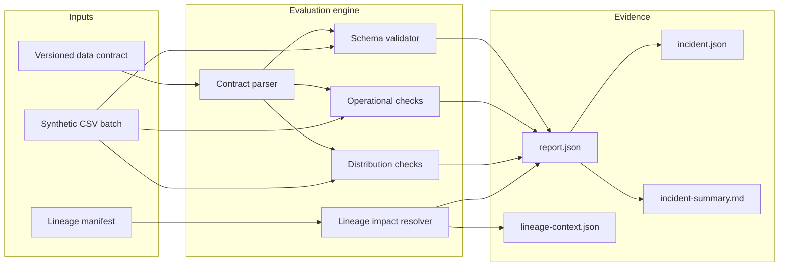
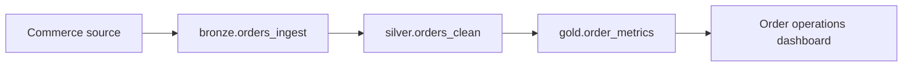

# Data Contracts + Observability


An executable, dependency-free reference implementation for validating a
dataset contract, evaluating operational health, tracing downstream impact, and
producing incident-ready evidence.

> [!IMPORTANT]
> **This is a synthetic portfolio demonstration.** The datasets, timestamps,
> owners, incidents, platforms, SLO results, and lineage are intentionally
> fictional for learning and evaluation. The repository demonstrates working
> engineering patterns; it does not claim a production deployment or historical
> business outcome.

## What this demonstrates

| Capability | Implementation |
|---|---|
| Executable contract | Versioned JSON schema with ownership, tier, checks, and SLO target |
| Schema guardrails | Required columns, primitive types, and nullability with CSV line numbers |
| Operational checks | Freshness, row-volume bounds, and business-key uniqueness |
| Distribution checks | Allowed domains, numeric ranges, and null-rate thresholds |
| Lineage | Validated DAG with direct and transitive impact traversal |
| Incident evidence | JSON report, incident summary, human-readable Markdown, and runbook |
| Delivery discipline | Deterministic tests, container, Make targets, and matrix CI |

The runtime uses only the Python standard library. That keeps the quality gate
fast, auditable, and runnable offline.

## Architecture



The synthetic lineage used by the demo is:



## Quick start

Requirements: Python 3.11+ and Make. No package download is required.

```bash
make check
make demo
```

The healthy run prints a compact status and creates:

```text
.artifacts/healthy/
├── incident-summary.md
├── incident.json
├── lineage-context.json
└── report.json
```

Exercise the failure path without causing Make to stop:

```bash
make incident
```

That fixture deliberately introduces low volume, stale data, a duplicate key,
an invalid status, out-of-range amounts, and a missing customer identifier. It
is designed to make the incident artifacts and runbook easy to review.

Checked-in golden outputs make the result inspectable without running the code:

- [`docs/examples/healthy-incident.json`](docs/examples/healthy-incident.json)
- [`docs/examples/breached-incident.json`](docs/examples/breached-incident.json)

The test suite regenerates both summaries and compares them structurally, so
documentation cannot quietly drift away from runtime behavior.

## CLI

Run the module directly from a checkout:

```bash
PYTHONPATH=src python3 -m data_observer run \
  --contract contracts/orders.contract.json \
  --data data/orders_healthy.csv \
  --lineage lineage/manifest.json \
  --output-dir .artifacts/healthy \
  --now 2026-07-28T12:00:00Z
```

Inspect impact for one asset:

```bash
PYTHONPATH=src python3 -m data_observer lineage \
  --manifest lineage/manifest.json \
  --asset silver.orders_clean
```

Render a stored report:

```bash
PYTHONPATH=src python3 -m data_observer summarize \
  --report .artifacts/healthy/report.json \
  --format markdown
```

Failed critical checks return exit code `1`, making the tool suitable for a CI
quality gate. Diagnostic workflows can opt into `--fail-on never`.

## Contract shape

The checked-in contract is intentionally readable and reviewable:

```json
{
  "dataset": "silver.orders_clean",
  "version": "1.2.0",
  "owner": "data-platform@example.invalid",
  "tier": 1,
  "checks": {
    "freshness": {
      "timestamp_column": "event_timestamp",
      "max_age_minutes": 120
    },
    "volume": {
      "min_rows": 5,
      "max_rows": 1000000
    },
    "uniqueness": ["order_id"]
  },
  "slo": {
    "target_percent": 99
  }
}
```

See [`contracts/orders.contract.json`](contracts/orders.contract.json) for the
complete schema and distribution rules.

## Design decisions

- **Contract errors fail early.** Unknown columns, unsupported types, duplicate
  fields, invalid tiers, and broken lineage references never become silent
  runtime skips.
- **Observations remain explainable.** Every check records expected and observed
  values, severity, a human message, and affected CSV line numbers where useful.
- **Lineage is part of incident scope.** Reports carry direct and transitive
  dependencies so responders can move from detection to impact assessment.
- **SLO language stays honest.** The evaluation score is a point-in-time
  compliance score, not a claimed historical availability metric.
- **Failure paths are first-class.** The incident fixture, non-zero exit code,
  runbook, and CI artifact upload make negative behavior testable.

## Container

```bash
docker build -t data-observer-demo .
docker run --rm data-observer-demo
```

The image runs as a non-root user and writes artifacts to `/tmp/observability`.

## Repository map

```text
.
├── .github/workflows/ci.yml
├── contracts/orders.contract.json
├── data/
│   ├── orders_healthy.csv
│   └── orders_incident.csv
├── docs/runbook.md
├── lineage/manifest.json
├── src/data_observer/
└── tests/
```

## Production evolution

A production implementation would add a contract registry, warehouse and stream
adapters, persisted check history, windowed SLIs and error-budget burn rates,
alert routing, OpenLineage emission, PII classification, policy enforcement,
and signed provenance for generated evidence. Those integrations are
intentionally outside this dependency-free demo.

## License

MIT — see [`LICENSE`](LICENSE).
